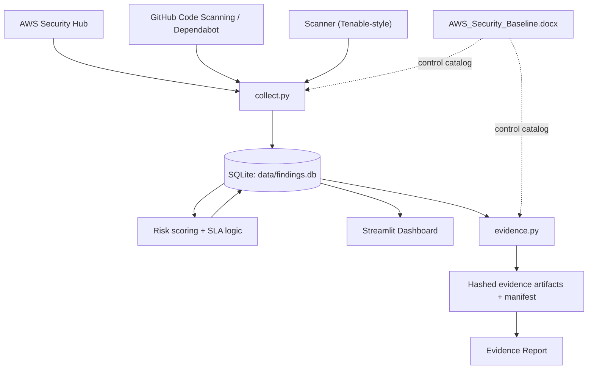

# Security Automation & Compliance Dashboard

A single pipeline that pulls vulnerability and misconfiguration findings from
three sources, scores them by actual risk (not just severity), tracks them
against SLA, visualizes the result live, and generates auditor-ready
compliance evidence from the same data — instead of four disconnected demos.



## Why this exists

Most portfolio security projects are a dashboard *or* a script *or* a policy
doc. This is one pipeline where the policy document, the pipeline, and the
evidence report all reference the same 12 AWS Security Hub controls — change
a remediation SLA in one place ([`collector/risk.py`](collector/risk.py)) and
the baseline document, the dashboard, and the evidence report are all
describing the same policy, not three independently-maintained ones.

Every source runs in mock mode by default, using data shaped exactly like the
real vendor payload (AWS Security Hub ASFF, GitHub code-scanning alert JSON,
a Tenable-style scanner export), so the whole thing runs with zero credentials
and zero cloud spend. Swapping in a live AWS account is a matter of
implementing the three `_fetch_live()` stubs in
[`collector/sources.py`](collector/sources.py) — the parsing, risk scoring,
storage, dashboard, and evidence logic don't change.

## Quickstart

```bash
pip install -r requirements.txt

python collect.py --csv        # pull findings from 3 mock sources → SQLite
python evidence.py             # generate compliance evidence from that data
streamlit run app.py           # launch the dashboard
```

Re-run `collect.py` any time — it's idempotent. Findings are upserted by ID,
so an unchanged finding keeps its original `first_seen` timestamp and its SLA
clock doesn't reset just because the collector ran again. This is meant to
run on a schedule (cron, GitHub Actions) the same way a real collector would.

## What's in here

| Path | What it is |
|---|---|
| `collect.py` | Orchestrates all 3 sources → normalizes → upserts into SQLite |
| `collector/models.py` | Shared `Finding` schema + severity normalization |
| `collector/sources.py` | One adapter per source (AWS Security Hub, GitHub, scanner) |
| `collector/risk.py` | SLA policy + risk score formula (documented, not a black box) |
| `collector/db.py` | Schema, idempotent upsert, collector-run audit trail |
| `app.py` | Streamlit dashboard, reads live from `data/findings.db` |
| `evidence.py` | Compliance evidence automation — the Drata-style step |
| `compliance/control_catalog.py` | Maps each control to SOC 2 / ISO 27001 references |
| `AWS_Security_Baseline.docx` | The policy document the pipeline actually enforces |
| `mock_data/generate_mock_data.py` | Regenerates the 3 mock vendor payloads (seeded) |

## The risk score isn't just severity

A CVSS score alone doesn't tell you what to fix first. This pipeline computes:

```
risk_score = severity_weight × asset_criticality_multiplier × SLA_age_multiplier
```

An aging critical finding on an internet-facing asset outranks a
freshly-discovered critical on a dev sandbox — and a finding that's sat open
for 2x its SLA window outranks one still within it. The full formula and
constants are in [`collector/risk.py`](collector/risk.py), written to be
read and argued with, not just executed.

## The evidence step proves something, not just logs it

`evidence.py` doesn't re-scan anything — it evaluates the *same* database the
dashboard reads, against a control catalog mapped to SOC 2 and ISO 27001, and
writes:

- one JSON evidence export per control (the raw matching findings)
- a SHA-256 hash of that export in the manifest, so tampering after the fact
  is detectable
- a status per control: `PASS`, `PASS_WITH_EXCEPTION` (documented risk
  acceptance), `FAIL`, or `NOT_OBSERVED` (the control never triggered a
  finding — which is *not* the same as passing, and the report says so)
- a human-readable `Compliance_Evidence_Report.md` an auditor could actually read

Run it after `collect.py` and check `data/evidence/latest_report.md`.

## Honest limitations

- Mock mode only. `_fetch_live()` in each source adapter is intentionally
  unimplemented — this is a portfolio build, not a production integration.
  Wiring a real AWS account is additive, not a rewrite.
- Ownership assignment is a keyword heuristic (see `collector/sources.py`),
  standing in for a real CMDB/asset-tag lookup.
- The risk-scoring constants encode one reasonable policy, not a universal
  standard — they're deliberately easy to find and change in one file.

## Stack

Python · SQLite · Streamlit · Plotly · pandas · docx (document generation)
